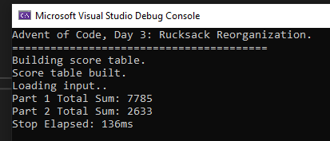
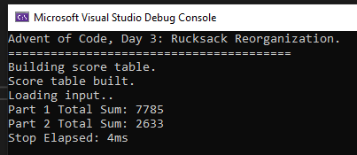

# Advent of Code, Day 3: Rucksack Reorganization

Part 1 lead me into a false sense of security. A bit of comfort. 
When Part 2 hit, it totally threw me. I had an *idea* of what I wanted to do, but didn't really know the best way to go about it. 

Im shocked actually by the speed of execution presented here, considering how STL heavy this approach is. 
Lots is going on under the hood here, but on my machine in debug mode:

and in Release mode:
